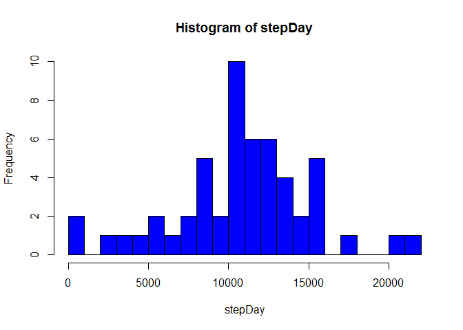
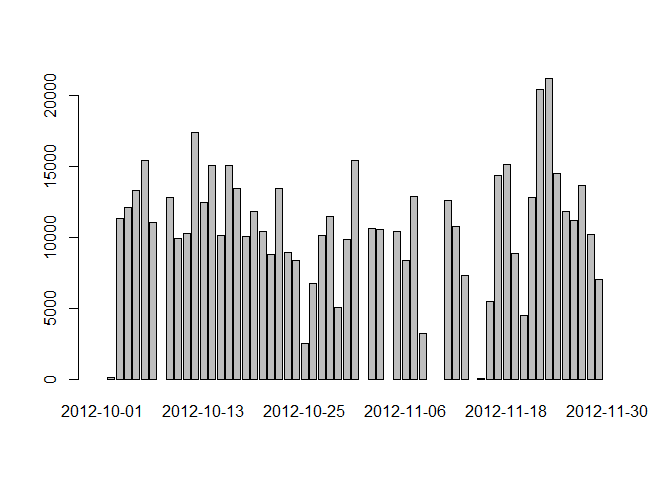
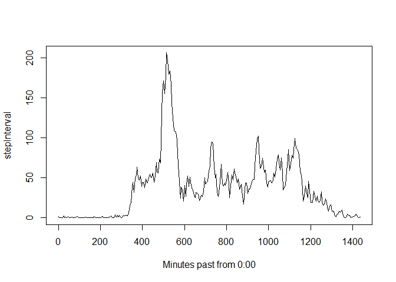
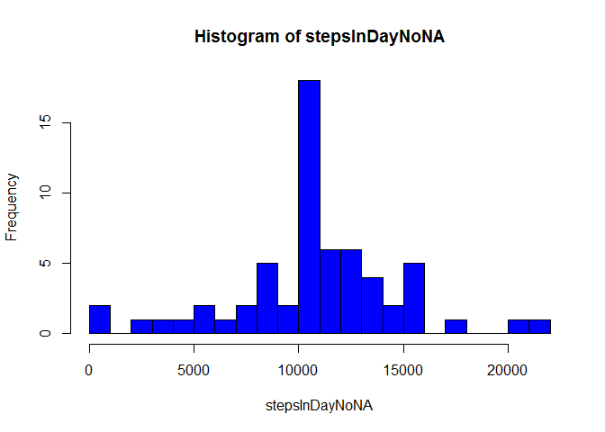
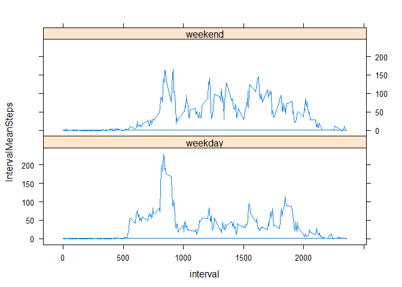

# Reproducible Research: Peer Assessment 1


## Loading and preprocessing the data

###Set time format and working directory


```r
setwd("c:\\WorkDir\\Study\\Coursera\\ReproduciableResearch\\")
Sys.setlocale("LC_TIME", "English")
```

###Load data


```r
data<-read.csv("c:\\WorkDir\\Study\\Coursera\\ReproduciableResearch\\repdatadataactivity\\activity.csv")
```

###Process/transform the data


```r
data$date<-factor(data$date)
data$timeInterval<-(data$interval-data$interval%%100)/100*60+data$interval%%100
```

## What is mean total number of steps taken per day?
###Calculate the total number of steps taken per day

```r
stepDay<-sapply(split(data, data$date), function(x) sum(x$steps))
stepDay
```

```
## 2012-10-01 2012-10-02 2012-10-03 2012-10-04 2012-10-05 2012-10-06 
##         NA        126      11352      12116      13294      15420 
## 2012-10-07 2012-10-08 2012-10-09 2012-10-10 2012-10-11 2012-10-12 
##      11015         NA      12811       9900      10304      17382 
## 2012-10-13 2012-10-14 2012-10-15 2012-10-16 2012-10-17 2012-10-18 
##      12426      15098      10139      15084      13452      10056 
## 2012-10-19 2012-10-20 2012-10-21 2012-10-22 2012-10-23 2012-10-24 
##      11829      10395       8821      13460       8918       8355 
## 2012-10-25 2012-10-26 2012-10-27 2012-10-28 2012-10-29 2012-10-30 
##       2492       6778      10119      11458       5018       9819 
## 2012-10-31 2012-11-01 2012-11-02 2012-11-03 2012-11-04 2012-11-05 
##      15414         NA      10600      10571         NA      10439 
## 2012-11-06 2012-11-07 2012-11-08 2012-11-09 2012-11-10 2012-11-11 
##       8334      12883       3219         NA         NA      12608 
## 2012-11-12 2012-11-13 2012-11-14 2012-11-15 2012-11-16 2012-11-17 
##      10765       7336         NA         41       5441      14339 
## 2012-11-18 2012-11-19 2012-11-20 2012-11-21 2012-11-22 2012-11-23 
##      15110       8841       4472      12787      20427      21194 
## 2012-11-24 2012-11-25 2012-11-26 2012-11-27 2012-11-28 2012-11-29 
##      14478      11834      11162      13646      10183       7047 
## 2012-11-30 
##         NA
```

###Compare histogram and barplot 

```r
hist(stepDay,col="blue",breaks=20)
```

 

```r
barplot(stepDay)
```

 

###Calculate and report the mean and median of the total number of steps taken per day

```r
mean(stepDay,na.rm=TRUE)
```

```
## [1] 10766.19
```

```r
median(stepDay,na.rm=TRUE)
```

```
## [1] 10765
```


## What is the average daily activity pattern?
###Make a time series plot (i.e. type = "l") of the 5-minute interval (x-axis) and the average number of steps taken, averaged across all days (y-axis)


```r
stepInterval<-sapply(split(data, data$timeInterval), function(x) mean(x$steps,na.rm=TRUE))
plot(names(stepInterval),stepInterval, type="l",xlab="Minutes past from 0:00")
```

 


###Which 5-minute interval, on average across all the days in the dataset, contains the maximum number of steps?

```r
ans<-names(stepInterval[stepInterval==max(stepInterval)])
paste(as.character(as.integer(as.integer(ans)/60)), as.character(as.integer(ans)%%60),sep=":")
```

```
## [1] "8:35"
```


## Imputing missing values
###Calculate and report the total number of missing values in the dataset (i.e. the total number of rows with NAs)

```r
summary(data$steps)["NA's"]
```

```
## NA's 
## 2304
```


###Devise a strategy for filling in all of the missing values in the dataset. The strategy does not need to be sophisticated. For example, you could use the mean/median for that day, or the mean for that 5-minute interval, etc.

Missing values will be replaced with an average value of steps taken in the corresponding 5-min interval in days when such values are available. Moreover if the average number is not integer we transform it to integer using function as.integer().

###Create a new dataset that is equal to the original dataset but with the missing data filled in.


```r
datanoNA<-data
for(var in which(is.na(data$steps))) {datanoNA$steps[var]<-as.integer(stepInterval[as.character(data$timeInterval[var])])}
```


###Make a histogram of the total number of steps taken each day and Calculate and report the mean and median total number of steps taken per day. Do these values differ from the estimates from the first part of the assignment? What is the impact of imputing missing data on the estimates of the total daily number of steps?

```r
stepsInDayNoNA<-sapply(split(datanoNA, datanoNA$date), function(x) sum(x$steps))
stepsInDayNoNA
```

```
## 2012-10-01 2012-10-02 2012-10-03 2012-10-04 2012-10-05 2012-10-06 
##      10641        126      11352      12116      13294      15420 
## 2012-10-07 2012-10-08 2012-10-09 2012-10-10 2012-10-11 2012-10-12 
##      11015      10641      12811       9900      10304      17382 
## 2012-10-13 2012-10-14 2012-10-15 2012-10-16 2012-10-17 2012-10-18 
##      12426      15098      10139      15084      13452      10056 
## 2012-10-19 2012-10-20 2012-10-21 2012-10-22 2012-10-23 2012-10-24 
##      11829      10395       8821      13460       8918       8355 
## 2012-10-25 2012-10-26 2012-10-27 2012-10-28 2012-10-29 2012-10-30 
##       2492       6778      10119      11458       5018       9819 
## 2012-10-31 2012-11-01 2012-11-02 2012-11-03 2012-11-04 2012-11-05 
##      15414      10641      10600      10571      10641      10439 
## 2012-11-06 2012-11-07 2012-11-08 2012-11-09 2012-11-10 2012-11-11 
##       8334      12883       3219      10641      10641      12608 
## 2012-11-12 2012-11-13 2012-11-14 2012-11-15 2012-11-16 2012-11-17 
##      10765       7336      10641         41       5441      14339 
## 2012-11-18 2012-11-19 2012-11-20 2012-11-21 2012-11-22 2012-11-23 
##      15110       8841       4472      12787      20427      21194 
## 2012-11-24 2012-11-25 2012-11-26 2012-11-27 2012-11-28 2012-11-29 
##      14478      11834      11162      13646      10183       7047 
## 2012-11-30 
##      10641
```

```r
mean(stepsInDayNoNA,na.rm=FALSE)
```

```
## [1] 10749.77
```

```r
median(stepsInDayNoNA,na.rm=FALSE)
```

```
## [1] 10641
```

```r
sum(stepsInDayNoNA)
```

```
## [1] 655736
```

```r
sum(stepDay,na.rm=TRUE)
```

```
## [1] 570608
```

```r
hist(stepsInDayNoNA,col="blue",breaks=20)
```

 

```r
stepsInDayNoNA-stepDay
```

```
## 2012-10-01 2012-10-02 2012-10-03 2012-10-04 2012-10-05 2012-10-06 
##         NA          0          0          0          0          0 
## 2012-10-07 2012-10-08 2012-10-09 2012-10-10 2012-10-11 2012-10-12 
##          0         NA          0          0          0          0 
## 2012-10-13 2012-10-14 2012-10-15 2012-10-16 2012-10-17 2012-10-18 
##          0          0          0          0          0          0 
## 2012-10-19 2012-10-20 2012-10-21 2012-10-22 2012-10-23 2012-10-24 
##          0          0          0          0          0          0 
## 2012-10-25 2012-10-26 2012-10-27 2012-10-28 2012-10-29 2012-10-30 
##          0          0          0          0          0          0 
## 2012-10-31 2012-11-01 2012-11-02 2012-11-03 2012-11-04 2012-11-05 
##          0         NA          0          0         NA          0 
## 2012-11-06 2012-11-07 2012-11-08 2012-11-09 2012-11-10 2012-11-11 
##          0          0          0         NA         NA          0 
## 2012-11-12 2012-11-13 2012-11-14 2012-11-15 2012-11-16 2012-11-17 
##          0          0         NA          0          0          0 
## 2012-11-18 2012-11-19 2012-11-20 2012-11-21 2012-11-22 2012-11-23 
##          0          0          0          0          0          0 
## 2012-11-24 2012-11-25 2012-11-26 2012-11-27 2012-11-28 2012-11-29 
##          0          0          0          0          0          0 
## 2012-11-30 
##         NA
```


## Are there differences in activity patterns between weekdays and weekends?

###Create a new factor variable in the dataset with two levels – “weekday” and “weekend” indicating whether a given date is a weekday or weekend day.

```r
wEnd<-function(x){
if (x=="Sunday" | x=="Saturday")
{ans="weekend"}
else {ans="weekday"}
ans
}
datanoNA$weekend<-factor(sapply(weekdays(strptime( as.character(datanoNA$date),"%Y-%m-%d" )),wEnd))
```

```
## Warning in strptime(as.character(datanoNA$date), "%Y-%m-%d"): unable to identify current timezone '5;0@CAL ':
## please set environment variable 'TZ'
```

```
## Warning in strptime(as.character(datanoNA$date), "%Y-%m-%d"): unknown
## timezone 'localtime'
```


###Make a panel plot containing a time series plot (i.e. type = "l") of the 5-minute interval (x-axis) and the average number of steps taken, averaged across all weekday days or weekend days (y-axis). See the README file in the GitHub repository to see an example of what this plot should look like using simulated data.


```r
avStep<-sapply(split(datanoNA, datanoNA$weekend), function(x) {sapply(split(x,x$timeInterval), function(y) mean(y$steps) )} ) 
datanoNA$IntervalMeanSteps<-replicate(dim(datanoNA)[1],0)
for(i in 1:dim(datanoNA)[1])
{
if (datanoNA$weekend[i]=="weekday") { datanoNA$IntervalMeanSteps[i]<-avStep[ datanoNA$timeInterval[i]/5+1,1]}
else { datanoNA$IntervalMeanSteps[i]<-avStep[datanoNA$timeInterval[i]/5+1,2]} 
}
library(lattice)
xyplot( IntervalMeanSteps  ~ interval  | weekend,data=datanoNA,layout=c(1,2), type="l")
```

 
